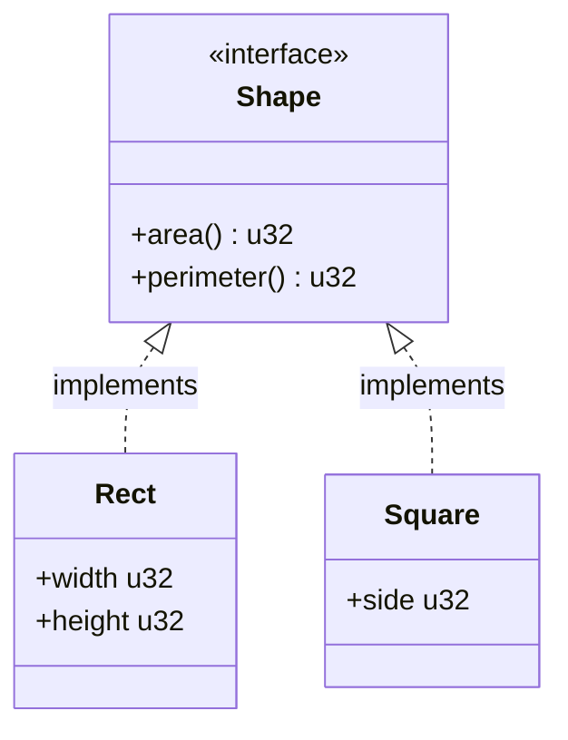
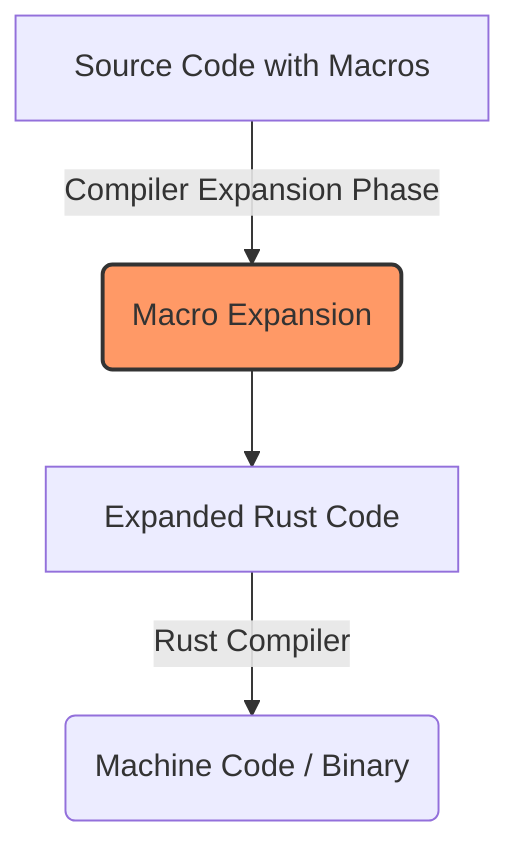

# Superdev Web3 Rust - Week 1: Traits, Macros, and Serialization

Welcome to the **Superdev Web3 Rust** foundational week! This project explores the core Rust concepts that are essential for high-performance systems and blockchain development (specifically Solana/Anchor).

## 🚀 Overview

This repository demonstrates the following advanced Rust concepts:
1.  **Traits**: Defining shared behavior across different types.
2.  **Generics & `impl Trait`**: Writing flexible, polymorphic functions.
3.  **Metaprogramming with Macros**: Understanding how code generates code at compile time.
4.  **Serialization & Deserialization**: Manually handling data conversion between structs and byte arrays—a critical skill for on-chain development.

---

## 🧠 Core Concepts & Theory

### 1. Traits: The Power of Shared Behavior
In Rust, **Traits** are similar to interfaces in other languages. they define a set of methods that a type must implement. This allows for **Polymorphism**—treating different types as the same kind of thing if they share the same trait.



- **`Shape` Trait**: Implemented by `Rect` and `Square`. It ensures any "Shape" can calculate its `area()` and `perimeter()`.
- **`impl Trait`**: Used in `get_area_and_perimeter(s: impl Shape)`. This is a syntax sugar for generics, allowing the function to accept any type that implements the `Shape` trait without knowing the specific type at compile time (Static Dispatch).

### 2. Macros: Writing Code that Writes Code
Macros in Rust are a form of **Metaprogramming**. They look like functions but end with an `!` (e.g., `println!`).



- **Macro Expansion**: Unlike functions, macros are expanded into actual Rust code *during compilation*. This code never "runs" as a macro; it's transformed before being turned into a binary.
- **Why use them?** They are crucial for writing boilerplate-heavy code, such as smart contracts in **Anchor** or **Pinochio**.
- **`#[derive(Debug)]`**: A **Procedural Macro (Custom Derive)**. It automatically generates the code needed to format a struct for debugging, saving you from writing the `std::fmt::Debug` implementation manually.

### 3. Serialization & Deserialization
In Web3 development, especially on Solana, data is stored in "Accounts" as raw bytes. We need to convert our Rust structs into bytes to save them and back into structs to use them.

```mermaid
flowchart LR
    A[Rust Struct] -- Serialize --> B(Byte Array [u8])
    B -- Deserialize --> C[Rust Struct]
    
    subgraph Storage
    B
    end
```

- **Serialization**: Converting a `struct` into a `Vec<u8>` (byte vector).
- **Deserialization**: Converting a slice of bytes `&[u8]` back into a `struct`.
- **Theory**: We use `Big-Endian` (`to_be_bytes`) for consistent byte ordering across different network architectures.

---

## 🛠️ Implementation Walkthrough

### Logic Components
- **`Rect` & `Square`**: Simple data structures representing geometric shapes.
- **`User`**: Demonstrates the use of the `Debug` derive macro for easy logging.
- **`Swap`**: A practical example of custom serialization. It takes two quantities (`qty_1`, `qty_2`) and packs them into a byte array.

### Compilation Process
Whenever you run `cargo run`:
1.  **Macro Expansion**: `println!` and `#[derive(Debug)]` are expanded into standard Rust code.
2.  **Compilation**: The expanded code is compiled into machine code.
3.  **Binary Generation**: A binary (executable) is created in `target/debug/`.
4.  **Execution**: The binary is run on your machine.

---

## 🏁 How to Run

1.  **Build the project**:
    ```bash
    cargo build
    ```
2.  **Run the project**:
    ```bash
    cargo run
    ```
3.  **Explore Macro Expansion** (requires `cargo-expand`):
    ```bash
    cargo expand
    ```

---

## 📚 Tools Used
- **`cargo-expand`**: Used to see what the macros turn into before final compilation.
- **Standard Library (`std`)**: Leveraging `fmt::Debug` and `u32` byte conversion utilities.

---
*Developed for the 100xBootcamp Superdev Web3 Track.*
